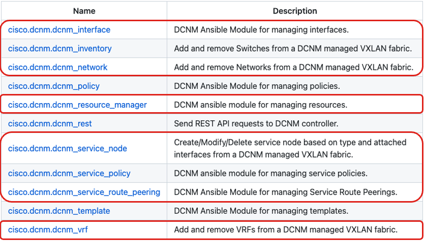
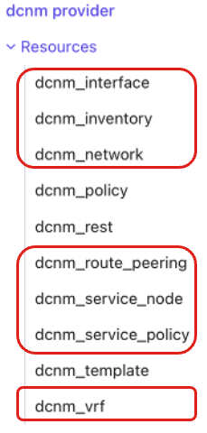

# NDFC Operation Overview

Any management tool or automation framework does not absolve the network engineer from actually knowing how to engineer a network. The tools are designed to ultimately make the tasks an engineer undertakes either:

- easier
- faster
- more repeatable
- more consistent
- any/all of the above

## Typical Workflow

Like all infrastructure management platforms, NDFC has a category of tasks that you manage once (Day 0), tasks you manage from time to time (Day 1), and Day 2 Adds/Moves/Changes.

For network engineers, historical challenges with automation and Infrastructure as Code is weighing the value versus effort of the Day 0 tasks.  Sometimes, even Day 1 can be challenging to justify. Fortunately, the rapid proliferation of REST API and supporting ecosystems is lowering the effort required. Ultimately, the value in having the setup well documented is worth it for a variety of reasons.

For NDFC, the workflow to proceed from running appliance to functioning network depends on the network type you are building (VXLAN versus Classic).  However, they both have similar Day 0 tasks:

**Day 0**
- Define Fabric
- Add Switches
- Define Switch Roles
- Pair VPC Switches
- Deploy Config

The significant difference between the two fabric types comes in the Day 1 tasks. For VXLAN, Day 1 looks like the following:

**Day 1**
- Define VRF(s)
- Attach VRF(s)
- Deploy Config
- Define Network(s)
- Attach Network(s)
- Deploy Config

For Classic Ethernet networks, Day 1 looks significant different because, among other things, VXLAN fabrics are very prescriptive whereas Classic Ethernet designs can really take any shape or form. As such, for a typical "Routed Aggregation and switched Top of Rack" design, Day 1 could look like this:

**Day 1**
- Enable NXOS Features
- Create VPC Domain
- Create VLANs
- Configure Spanning Tree
- Create SVIs
- Enable HSRP
- Create VPCs (between Agg and ToR)
- Configure Dynamic Routing Protocols

After Day 1, ongoing operational changes via Adds, Moves, and Changes returns to fairly similar workflows:

**Adds, Moves, Changes**
- Configure Interfaces
- Deploy Config

## Terminology

As an aside, here are definitions for the DCNM/NDFC terminology used above:

- **Fabric**: a group of switches that will be managed similarly by NDFC. Common types are "Easy Fabric" for VXLAN EVPN fabrics and "LAN Classic" for classic Ethernet fabrics.
- **Role**: the network function of a switch in the fabric. Roles are only critically important in VXLAN EVPN fabrics where roles such as "spine" and "leaf" drive the default and operational configurations permitted on the switch.
- **Networks**: VXLAN Fabric specific, this maps directly to a bridge domain (VLAN), its associated 802.1Q tag and name/label and VXLAN L2 VNI value. If this bridge domain is routed **within** the fabric, it also includes an IP subnet and the VRF to which it belongs.
- **Config Save**: the NDFC action that saves setting within the NDFC application related to the design intent the engineer is configuring within NDFC. Recall, NDFC is decoupled from the hardware (unlike APIC in ACI) and "state" saved in NDFC is not automatically pushed to switches.
- **Config Preview**: the NDFC action that converts the saved settings/intent in NDFC into NX-OS configuration of 3 classes:
    - Expected Config: The end state configuration that NDFC expects to find on the switch.
    - Running Config: The current, actual configuration that NDFC finds on the switch.
    - Pending Config: The CLI configuration required to move the switch from Running Config to Expected Config.
- **Config Deploy**: the NDFC action that pushes the "Pending Config" to the switch

## Ansible and Terraform

The general workflows describe above have various levels of support within the Terraform provider and Ansible collection. Fortunately, the modules or resources are named in ways that make their usage fairly straightforward. Unfortunately, the primary focus of support for both automation platforms has been VXLAN EVPN fabrics. In the list of Ansible modules and Terraform resources below, the items indicated by red ovals are those entities specific designed and tested for VXLAN EVPN fabrics.

| **Ansible Modules** | **Terraform Resources** |
| ------------------- | ----------------------- |
|  |  |

The one entity that can still be leverage for **most** uses in classic Ethernet designs is **dcnm_interface**. We'll see the specific use case later in the workshop where it doesn't have the necessary interface type.

## The Gaps

Now we come to the motivation for this workshop - what are the gaps and how do we bridge them to have working automation (dare I say, even, Infrastructure as Code)? As you my suspect from the content above, the gaps are a bit more significant for classic Ethernet designs, compared to VXLAN EVPN fabrics.

**VXLAN Fabrics**

- Fabric Creation
- Multi-site Domain Assignment (not covered in lab)
- VPC Pairing (code included, not covered in lab)

**Classic Ethernet**

- Fabric Creation
- Switch Addition and Role Assignment
- SVI Creation

These above gaps must be remedied by the "catch all" Terraform/Ansible entity **dcnm_rest**, where we are going to provide a NDFC REST API endpoint and the request body necessary to configure NDFC correctly.

Now, the astute student may notice that there seem to be a lot more gaps in the classic Ethernet workflow above compared to the Ansible or Terraform objects available. Fortunately, those missing entities are managed by the dcnm_policy module.

What's the difference between dcnm_rest and dcnm_policy? Essentially, state and impotence.

## What's Next

Both the **dcnm_rest** and **dcnm_policy** entities require a deeper knowledge of the API and Templates within NDFC. The next section will begin our investigations into the internals of NDFC so that we can extract the JSON and YAML needed to complete the automation of our NDFC fabric.

## Reference Materials

- [NDFC 12.0.x Configuration Guide](https://www.cisco.com/c/en/us/td/docs/dcn/ndfc/1201/configuration/fabric-controller/cisco-ndfc-fabric-controller-configuration-guide-1201.html)
- [NDFC 12.0.x Release Notes](https://www.cisco.com/c/en/us/td/docs/dcn/ndfc/1202/release-notes/cisco-ndfc-release-notes-1202.html)
- [DCNM Collection on Ansible Galaxy](https://galaxy.ansible.com/cisco/dcnm) ([GitHub](https://github.com/CiscoDevNet/ansible-dcnm))
- [DCNM Provider on Terraform Registry](https://registry.terraform.io/providers/CiscoDevNet/dcnm/latest) ([GitHub](https://github.com/CiscoDevNet/terraform-provider-dcnm))
