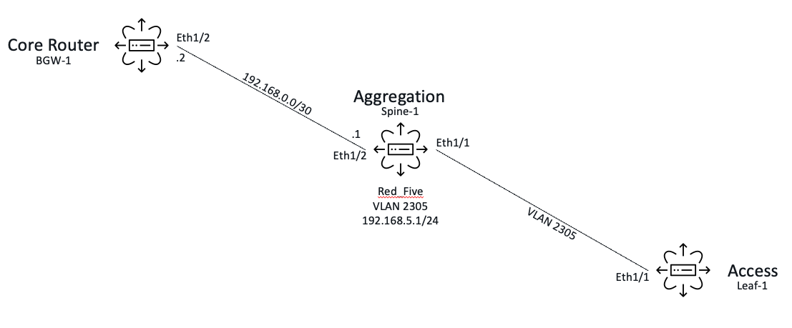
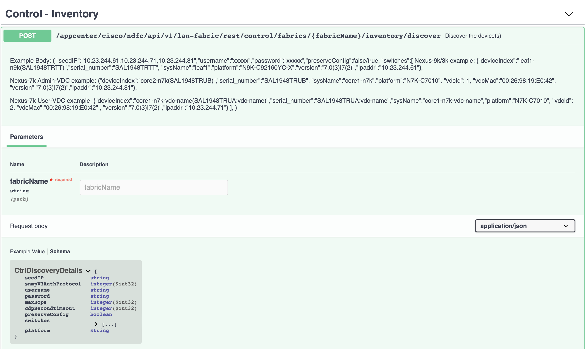
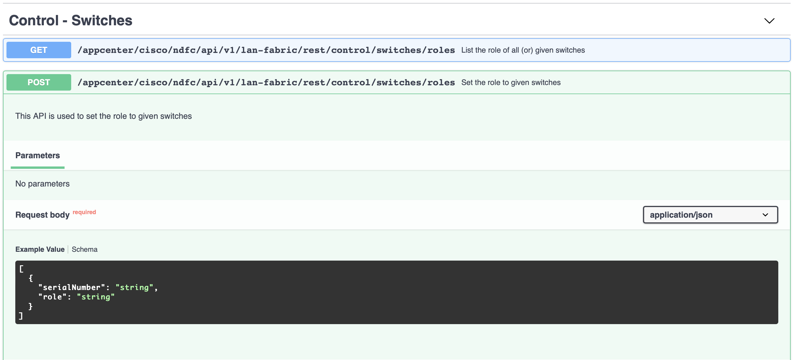
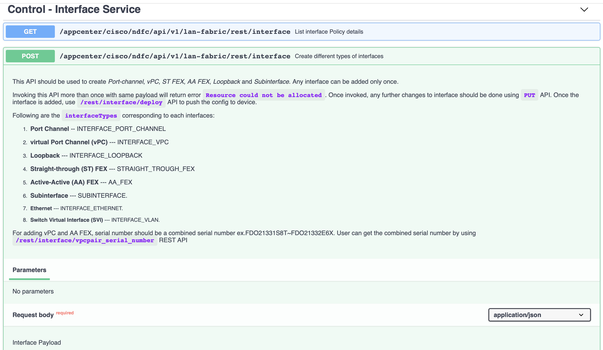

# Classic Ethernet Automation

You can't automate what you don't know. Or, to put it another way, automation doesn't absolve you from knowing how to be a network engineer. Automation is a tool to make your job easier. With VXLAN EVPN fabrics, the depth of expertise is abstracted away by NDFC leveraging best practices for an architecture that is fairly prescriptive.

With Classic Ethernet designs, given the wide range of designs and configurations possible, you have to know what technologies and services have to be implemented and the settings needed for them.

## Classic Ethernet Example

We are going to quickly walk through the automation of the Layer-3 aggregation router in the drawing below.



The bulk of this section is focused on the aggregation router ("spine1"). However, because of some symmetry and standardization in the design, we'll be able to quickly provision other elements on the core router ("bgw1") and the access switch ("leaf1") at the same time as the aggregation elements.

But first, we must create the fabric that defines how NDFC will manage these switches.

## Fabric Creation

Recall from our [NDFC utility tutorial](./02a-setup.md) that we need to create a fabric using the **LAN_Classic** template whose available parameters are (output using **-verbose** flag), using the REST API in the process:

```
(optional): AAA_REMOTE_IP_ENABLED               : Enable only, when IP Authorization is enabled in the AAA Server               : false
(optional): AAA_SERVER_CONF                     : AAA Configurations                                                            : 
(optional): BOOTSTRAP_CONF                      : Additional CLIs required during device bootup/login e.g. AAA/Radius           : 
(optional): BOOTSTRAP_ENABLE                    : Automatic IP Assignment For POAP                                              : false
(optional): BOOTSTRAP_MULTISUBNET               : lines with # prefix are ignored here                                          : #Scope_Start_IP, Scope_End_IP, Scope_Default_Gateway, Scope_Subnet_Prefix
(optional): BOOTSTRAP_MULTISUBNET_INTERNAL                                                                                      : 
(optional): CDP_ENABLE                          : Enable CDP on management interface                                            : false
(optional): DCI_SUBNET_RANGE                    : Address range to assign P2P DCI Links                                         : 10.10.1.0/24
(optional): DCI_SUBNET_TARGET_MASK              : Target Mask for Subnet Range (Min:8, Max:31)                                  : 30
(optional): DEPLOYMENT_FREEZE                                                                                                   : false
(optional): DHCP_ENABLE                         : Automatic IP Assignment For POAP From Local DHCP Server                       : false
(required): DHCP_END                            : End Address For Switch Out-of-Band POAP                                       : 
(optional): DHCP_END_INTERNAL                                                                                                   : 
(optional): DHCP_IPV6_ENABLE                                                                                                    : DHCPv4
(optional): DHCP_IPV6_ENABLE_INTERNAL                                                                                           : 
(required): DHCP_START                          : Start Address For Switch Out-of-Band POAP                                     : 
(optional): DHCP_START_INTERNAL                                                                                                 : 
(optional): ENABLE_AAA                          : Include AAA configs from Advanced tab during device bootup                    : false
(optional): ENABLE_NETFLOW                      : Enable Netflow on VTEPs                                                       : false
(optional): ENABLE_NETFLOW_PREV                                                                                                 : 
(optional): ENABLE_NXAPI                        : Enable NX-API on port 443                                                     : false
(optional): ENABLE_NXAPI_HTTP                   : Enable NX-API on port 80                                                      : false
(optional): FABRIC_FREEFORM                     : Additional supported CLIs for all same OS (e.g. all NxOS etc) switches        : 
(required): FABRIC_NAME                         : Please provide the fabric name to create it (Max Size 32)                     : 
(required): FABRIC_TECHNOLOGY                                                                                                   : LANClassic
(required): FABRIC_TYPE                                                                                                         : External
(optional): FEATURE_PTP                                                                                                         : false
(required): FEATURE_PTP_INTERNAL                                                                                                : false
(required): FF                                                                                                                  : LANClassic
(optional): INBAND_MGMT                         : Import switches with inband connectivity                                      : false
(optional): INBAND_MGMT_PREV                                                                                                    : false
(required): IS_READ_ONLY                        : If enabled, fabric is only monitored. No configuration will be deployed       : true
(optional): LOOPBACK0_IP_RANGE                  : Typically Loopback0 IP Address Range                                          : 10.1.0.0/22
(required): MGMT_GW                             : Default Gateway For Management VRF On The Switch                              : 
(optional): MGMT_GW_INTERNAL                                                                                                    : 
(required): MGMT_PREFIX                         : (Min:8, Max:30)                                                               : 24
(optional): MGMT_PREFIX_INTERNAL                                                                                                : 
(optional): MGMT_V6PREFIX                       : (Min:64, Max:126)                                                             : 64
(optional): MGMT_V6PREFIX_INTERNAL                                                                                              : 
(required): MPLS_HANDOFF                                                                                                        : false
(required): MPLS_LB_ID                          : (Min:0, Max:1023)                                                             : 101
(required): MPLS_LOOPBACK_IP_RANGE              : MPLS Loopback IP Address Range                                                : 10.102.0.0/25
(required): NETFLOW_EXPORTER_LIST               : One or Multiple Netflow Exporters                                             : 
(required): NETFLOW_MONITOR_LIST                : One or Multiple Netflow Monitors                                              : 
(required): NETFLOW_RECORD_LIST                 : One or Multiple Netflow Records                                               : 
(optional): PM_ENABLE                                                                                                           : false
(optional): PM_ENABLE_PREV                                                                                                      : false
(required): POWER_REDUNDANCY_MODE               : Default Power Supply Mode For Bootstrapped NX-OS Switches                     : ps-redundant
(required): PTP_DOMAIN_ID                       : Multiple Independent PTP Clocking Subdomains <br />on a Single Network (M...  : 0
(required): PTP_LB_ID                           : (Min:0, Max:1023)                                                             : 0
(optional): SNMP_SERVER_HOST_TRAP               : Configure NDFC as a receiver for SNMP traps                                   : true
(required): SUBINTERFACE_RANGE                  : Per Border Dot1q Range For VRF Lite Connectivity (Min:2, Max:4093)            : 2-511
(optional): enableRealTimeBackup                : Backup hourly or on Re-sync only if there is any config deployment since ...  : false
(optional): enableScheduledBackup               : Backup at the specified time                                                  : false
(required): scheduledTime                       : Time in 24hr format. (00:00 to 23:59)                                         : 
```

As in the VXLAN EVPN fabric case, we can make quicker work of determining the parameters by looking at the NDFC interface at the same time. We are only looking at basic fabric setup without and management server functionality so that reduces the required number of attributes down to the following:

```json
{
      "FABRIC_NAME": "Greenfield",
      "IS_READ_ONLY": "false",
      "PM_ENABLE": "true",
      "SNMP_SERVER_HOST_TRAP": "true",
      "ENABLE_NXAPI": "true",
      "ENABLE_NXAPI_HTTP": "true",
      "enableRealTimeBackup": "true"
}
```

Modify the playbook **DEVWKS-3155-CL22/ansible/classic/01-create-fabric.yaml** accordingly in the editor window to the right, then run the playbook:

```bash
ansible-playbook classic/01-create-fabric.yaml
```

## Switch Addition

As discussed way back in the workshop [introduction](./01-intro.md), classic Ethernet fabrics do not have support for adding switches or setting their roles with Ansible modules or Terraform resources. This forces us to look for a direct REST API endpoint to help us with the task. This is similar to fabric creation but this workshop material didn't explicitly point it out (although, knowing the instructor, he talked ahead of his slides again and has already mentioned it.)

It's not quite intuitive in which category the switch addition and role assignment endpoints should reside, but if you review the [API Reference](https://developer.cisco.com/docs/nexus-dashboard-fabric-controller/12-0-2/#!api-reference-lan), you'll discover (ha!) the correct inventory discovery endpoint in "Control - Inventory":



You'll also find in "Control - Switches" the switch role endpoint:



Since the bodies of these payloads are a bit twitchy, the bulk of the effort has been done for you. Your only task with the Ansible playbook is to set the remaining two required parameters of the body for the discovery endpoint:

- the list of IPs to discover (string of comma-separated IP addresses)
- the setting to ensure a brownfield import

```
"seedIP": "198.18.4.101,198.18.4.102,198.18.4.103",
"preserveConfig": "true",
```

(Don't forget the trailing commas, and ensure the indentation is right.)

Once the updates have been made, apply the Ansible playbook.

```bash
ansible-playbook classic/02-add-switches.yaml
```

Yes, you are going to get an error with the "Add Switches" play. There is a known issue that has been reported. It does not prevent the switches from getting added to the fabric.  Since the playbook is instructed to ignore it, the role assignment still happens as well.

## The Aggregation Device

Let's now turn our focus to the aggregate switch and begin configuring it. The following high level design steps are needed to build it out:

- Establish routing protocol
- Create a network (VLAN and SVI)
- Create a trunk interface (to the ToR)
- Create a routed interface (to the Core)

To explain one possible method (that I use) to work through this design, I'll provide painstaking details for one example and then we'll abbreviate the process for the sake of time.

## Establish the routing protocol

With our networking engineering hat, we know the NX-OS steps to get us from a fresh install to deploying setting up the OSPF process on a switch:

```
feature ospf

router ospf 3155
  router-id 198.18.4.101

```

Our first task is to find the template(s) that could be related to those configurations:

```bash
ndfcctl --no-tls template list --filter ospf
```

In the resulting output, two entries show a create deal of promise:

- feature_ospf
- base_ospf

We can use our utility to get more specific information about each template:

```bash
ndfcctl --no-tls template get feature_ospf
ndfcctl --no-tls template get base_ospf
```

Including the parameters:

```bash
echo "Feature OSPF"
ndfcctl --no-tls template get feature_ospf --nvpairs --verbose
echo "Base OSPF"
ndfcctl --no-tls template get base_ospf --nvpairs --verbose
```

They both look like what we are looking for, but we can use the utility (and some shell script kung fu) to actually see the CLI configlet:

```bash
ndfcctl --no-tls template get base_ospf --full --verbose | grep newContent | cut -d: -f2- | python -c ' 
import sys
template = sys.stdin.read()
i = template.index("template content")
lines = template[i:].split("\\n")
for l in lines[1:-2]:
  print(l)
'
```

With a little scripting/templating background, we can reason out exactly what's going on here and this template is EXACTLY what we are looking for. We simply need to create a set of parameters for the aggregate router:

```json
{
  "OSPF_TAG": "3155",
  "LOOPBACK_IP": "198.18.4.102",
}
```

And a set for the core router:

```json
{
  "OSPF_TAG": "3155",
  "LOOPBACK_IP": "198.18.4.103",
}
```

Since we are using Ansible and the **dcnm_policy** module, we can avoid all the complications of the corresponding REST API endpoint (https://{{ndfc_ip_address}}/appcenter/cisco/ndfc/api/v1/lan-fabric/rest/control/policies) and its involved complete request body, shown here as an example:

```json
{
  "policyId": "DEMO-1",
  "description": "",
  "serialNumber": "{{ndfc_spine1_serial}}",
  "entityType": "SWITCH",
  "entityName": "SWITCH",
  "templateName": "base_ospf",
  "nvPairs": {
    "OSPF_TAG": "3155",
    "LOOPBACK_IP": "198.18.4.103",
  },
  "deleted": false,
  "priority": 200
}
```

Instead of those hoops to jump through, we can leverage the benefits the Ansible module brings and just focus on the 3 important quantities:

- template name
- template parameters
- policy priority

And, since the peering relationship could be dependent on each other, we can actually specify both routers to manage them together in the same play:

```yaml
- name: Enable OSPF Process on both routers
  dcnm_policy:
    fabric: "Greenfield"
    deploy: yes
    state: merged
    config:
      - switch:
        - ip: "198.18.4.102"
          policies:
            - name: "base_ospf"
              priority: 200
              create_additional_policy: false
              policy_vars:
                OSPF_TAG: "3155"
                LOOPBACK_IP: "198.18.4.102"
        - ip: "198.18.4.103"
          policies:
            - name: "base_ospf"
              priority: 200
              create_additional_policy: false
              policy_vars:
                OSPF_TAG: "3155"
                LOOPBACK_IP: "198.18.4.103"
```

All right, clear?  Perfect.  Now, your task in this stage is to modify the **DEVWKS-3155-CL22/ansible/classic/03-routing-protocols.yaml** playbook in the editor to the right to define the following parameters in the **vars** block.

- The policy name attributes are straight forward as you simply need to provide the string form of the policy name for each template.
- The policy vars are YAML dictionaries as shown above

Once updated, let's apply the playbook:

```bash
ansible-playbook classic/03-routing-protocols.yaml
```

(If you simply want the solution, check the solutions subdirectory.)

## Southbound Network

Okay, picking up speed now - we need to create the VLAN, SVI, and trunk interface to the access switch. As before, we need to engage our networking engineering brains to understand the target NX-OS configuration:

```
feature interface-vlan
vlan 2305
  name Red_Five

interface vlan2305
  description Example VLAN
  no switchport
  ip address 192.168.5.1/24
  no ip redirects

interface Ethernet1/1
  switchport
  switchport mode trunk
  switchport trunk allowed vlans 2305
  mtu 9216
  no shutdown

```

**VLAN SVI Creation**:

The first half is super easy, as we saw in the OSPF Router process section - **feature interface_vlan** command is simply a policy to be deployed via the **dcnm_policy** module that we can find in our increasingly familiar way (answer is: feature_interface_vlan_11_1)

```bash
ndfcctl --no-tls template list --filter feature | grep int
```

The second half is a bit more involved. Recall again from our [NDFC utility tutorial](./02a-setup.md) that we need to create the SVI using the interfaces REST API:



Even though we will be calling a REST API endpoint, we'll still need to provide the relevant template and its parameters.  To find the right interface policy you can cheat and look in the GUI (Switch->Interfaces->Action->Create Interface) or you can leverage your NDFC experience recalling that interface policies begin with 'int_' and likely have 'vlan' in the name:

```bash
ndfcctl --no-tls template list --filter vlan | egrep ^int_
```

The best fit for the policy would seem to be **int_vlan**:

```bash
ndfcctl --no-tls template get int_vlan
```

The parameters (nvpairs) required for that template are:

```bash
ndfcctl --no-tls template get int_vlan --nvpairs --verbose
```

To see the final results, we can look at the entire JSON Request body that will be sent to the REST API in the file **DEVWKS-3155-CL22/ansible/svi_data.json**.  Because of the JSON complexity, it was simply easier to store it cleanly as pure JSON, read it into Ansible via native mechanisms, and pass it to the API directly, rather then try to store the JSON in a YAML file.

**VLAN Creation**:

Speeding up even further, the template needed to create VLANs is **create_vlan** and we can leverage the **dcnm_policy** module to deploy it. So, quick review of its parameters:


```bash
ndfcctl --no-tls template get create_vlan --nvpairs --verbose
```

Whose output is:

```
(optional): MODE                                : Mode CE or FABRICPATH                                                         : CE
(optional): NAME                                : if &gt; 32 chars enable:system vlan long-name                                 : 
(optional): VLAN                                : VLAN Identifier                                                               : 
(optional): VNI                                 : Virtual Network Identifier (1-16777214)                                       : 
```

Recall from the OSPF router process steps above, we simply need a template name, parameters (in a YAML dictionary), a priority, and switch IPs on which to deploy the policy:

```yaml
- name: Create VLAN on Access
  dcnm_policy:
    fabric: "Greenfield"
    deploy: yes
    state: merged
    config:
      - name: "create_vlan"
        priority: 200
        create_additional_policy: false
        policy_vars:
          NAME: "Red_Five"
          VLAN: 2305
          MODE: "CE"
      - switch:
        - ip: "198.18.4.101"
```

For the sake of time, this sections required changes to the Ansible playbook related to the VLAN creation have been pre-populated for you.

**Trunk Interface Creation**:

Fortunately, since the trunk between aggregation and access is a standard interface type across both VXLAN EVPN and Classic Ethernet fabric types, we'll simply be able to leverage the Ansible module as is, following its [documentation from the collection's GitHub](https://github.com/CiscoDevNet/ansible-dcnm/blob/main/docs/cisco.dcnm.dcnm_interface_module.rst). In our specific exercise, let's look at **DEVWKS-3155-CL22/ansible/classic/04-network-southbound.yaml** in the editor at the right. The play of interest is:

```yaml
- name: Create L2 Trunk to/from Access
  dcnm_interface:
    fabric: "{{ site1.fabric_name }}"
    check_deploy: yes
    state: merged
    config:
      - name: "Ethernet1/1"
        switch:
          - "{{ site1.spine1_ip }}"
          - "{{ site1.leaf1_ip }}"
        type: eth
        profile:
          admin_state: yes
          bpdu_guard: no
          mode: trunk
          mtu: jumbo
          port_type_fast: no
          allowed_vlans: "{{ vlan_policy_vars.VLAN }}"
```

With that, we are ready to push the southbound network configurations to both the aggregate router and access switch:

```bash
ansible-playbook classic/04-network-southbound.yaml
```

## Northbound Network

The remaining step again falls into the category of native Ansible module support, namely configuring routed interfaces on the two routers (core and aggregate). We've seen the trunked interface configuration above, now let's look at the routed interface configuration below. Whereas in the trunked case, the configuration was identical on both sides so the play was simple. In the routed case, we need unique IP addresses on both ends so we need a bit more than above:

```yaml
- name: Create L3 Routed Link between Core and Aggregate
  dcnm_interface:
    fabric: "{{ site1.fabric_name }}"
    check_deploy: yes
    state: merged
    config:
      - name: Ethernet1/2
        deploy: yes
        switch:
          - "{{ site1.spine1_ip }}"
        type: eth
        profile:
          admin_state: yes
          mode: "routed"
          mtu: "9216"
          ipv4_addr: 192.168.0.1
          ipv4_mask_len: 30
          cmds:
            - ip router ospf 3155 area 0.0.0.0
      - name: Ethernet1/2
        switch:
          - "{{ site1.bgw1_ip }}"
        type: eth
        profile:
          admin_state: yes
          mode: "routed"
          mtu: "9216"
          ipv4_addr: 192.168.0.2
          ipv4_mask_len: 30
          cmds:
            - ip router ospf 3155 area 0.0.0.0
```

To build out the routed interfaces, we apply the Ansible playbook:

```bash
ansible-playbook classic/05-network-northbound.yaml
```

## Summary

Seems like a lot of work, eh? It does show the power of prescriptive designs (VXLAN EVPN) - even if it does add complexity to technology employed, it does so by shifting complexity from the design side (well, when there's a controller in the mix, eh?)

